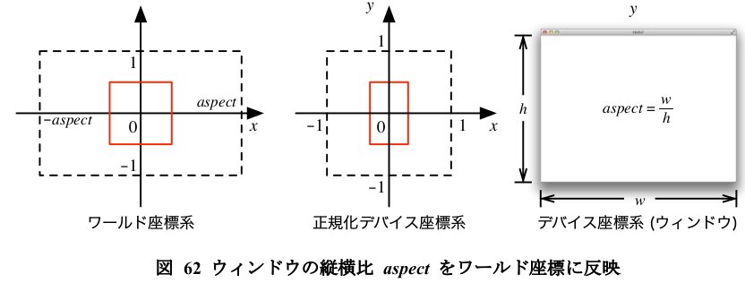
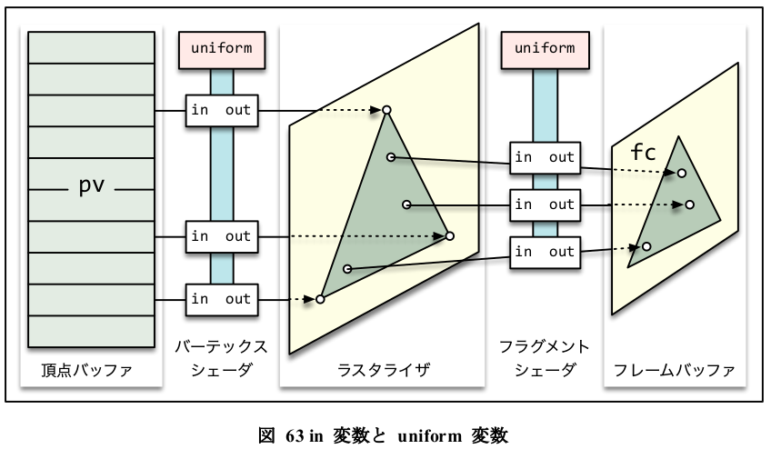

# ch06 Mouse and Keyboard - sample2

- 6.1.4 表示図形の縦横比の固定 (p.92)

- [Execute](#Execute)

---


## Execute

```
$ make
```


---


## 要約

> aspect = w / h
> 

> p.94
> このメンバ変数 aspect の値をシェーダプログラムに渡して, バーテックスシェーダで処理さ
> れる頂点の位置を変更します. aspect の値は一つの図形の描画中に変更されることはないので,
> これにはシェーダの uniform 変数を用います. in 変数 (4.2.2) が一つの頂点ごとに異なる情報を
> 保持しているのに対し,uniform 変数は一回の描画命令で使用される全ての頂点から共通して参
> 照される値を保持します.
> 

